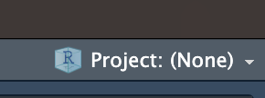

# **How To Set Up A GitHub Web Page**  
  
### Installing git

1. To install git, first copy, paste, and run the following code into your terminal:

```
/bin/bash -c "$(curl -fsSL https://raw.githubusercontent.com/Homebrew/install/HEAD/install.sh)"
```

2. Next copy, paste, and run the following code in your terminal:

```
brew install git
```

3. To test if git is installed open RStudio click on the top right icon with a blue cube shown below. Then click create new project. A display should appear with three options, click on version control. Another display will appear with two options, click on git. If an error message does not appear, git is installed and RStudio can detect it. If an error message does appear, follow the troubleshooting tips below.

    

#### Troubleshooting

* If you are having trouble installing homebrew it can be solved by installing xcode. To do this copy, paste, and run the code below:

```
xcode-select --install
```
  + Another way to install xcode is to directly install it to your computer by installing one of the versions [here](https://idmsa.apple.com/IDMSWebAuth/signin.html?path=%2Fdownload%2Fall%2F&appIdKey=891bd3417a7776362562d2197f89480a8547b108fd934911bcbea0110d07f757&rv=0)
  
* If you are confident that git is installed but RStudio is not detecting git, you can reassign its directory. to do this first you need to find where git is being stored on your computer. To do this type "where git" into your terminal. Then go to tools/global options/git. Once there there should be a option to browse the git directory. If the current path does not match with what the computer says the path is, change it to the correct path.

### Create a Repository
  
1. To Begin start by creating a GitHub account, the GitHub home page is linked [here](https://github.com).    
  
2. Once your account is setup you will want to create a repository. To do this, go to the homepage of github and look at the left side of your screen. If this is your first repository, click on the green box titled "Create Repository". If this is not your first repository, the green box should be titled "new". 
  
3. After the green box is clicked, multiple options will appear before the repository is created. Bellow are some options that are recommended:
    + Ensure that the name is something meaningful and insightful
    + Add a description that describes the purpose of the repository
    + Add a README file
    + Set the License to MIT
    
    Once this is done, click the create repository box  
    
4. From here, the repository page should be showing. If not, go back to the github home page and look in the left column. Click on your repository you just created.

5. From here click on the green box titled code shown below:

    

    And copy the url shown

6. Before we link the github and rstudio, we will need a personal token. To get one click on the dropdown next to your profile icon then click settings/developer settings/personal access tokens/tokens(classic). Click generate new token and then Generate New Token (classic). Create one with a descriptive name and have its expiration date be as long as you think you are going to use it. Once the token is created, copy the token and store it somplace safe on the computer. **NOTE: THIS WILL BE THE ONLY TIME GITHUB WILL LET YOU SEE YOUR TOKEN!**


7. Now head over to RStudio and click on the blue box in the top right corner shown below:

    

    Then click New Project/Version Control/Git

    If done correctly it should show a display that looks like this:
    
    
    
    Paste the URL from step 5 into the Repository URL box. In the Project directory name box, name it the exact same name as your repository. Finally create the project in whatever subdirectory you want.
    
8. Now that RStudio is linked to GitHub, you will need an index page. To do this go to file/new file/R Markdown. Title this whatever you want appearing on your front page and make sure html is selected. You can edit the RMarkdown file now but when you save the file, ensure that it is saved under the name index.Rmd. Once the index page is to your liking, knit it and move on to step 9 to push it to github.

9. Go over to the terminal box in RStudio and type "git status". A list of files should appear with text along the lines of "Changes not staged for commit". If you get an error message, ensure that you are typing in the terminal (NOT THE CONSOLE). We will need to add the files to commit them. Type "git add -A" to add all the files. You can view the status again by typing "git status" but the files should now be ready to commit. Type "git commit -am '<message>'" with <message> being some descriptive, short message of what you are committing. You can check your status again but you are now ready to push. Type git push in the console. Since this is the first time you are pushing, RStudio will ask for user verification. The username will be you github username and the password will be your user token that you should have saved from step 6.

10. Go Back to your GitHub Repository page and you should see a list of your files including your index.html and index.Rmd files. Now go to settings/pages/Branch. Click on none and select main. Save the changes and congrats, you now have a GitHub Repository webpage! You can view it by typing YourUsername.github.io/RepositoryName. Note: it may take a few minutes for GitHub to create/update your webpage.

#### Troubleshooting

* If you have installed git correctly but the terminal is not executing the git commands, you most likely do not have xcode. Follow the tips in the Installing Git Troubleshooting section to install xcode.

* If your webpage is not showing, ensure that your github repository homepage is showing both an index.html and an index.Rmd file. If it only shows a index.Rmd file, you likely did not knit it. Go back to RStudio and knit the file and then follow step 9 to push the new file to github.

* If there is still trouble, double check the following:
  + Does your project name match your repository name?
  + Is the URL you copied correct?
  + Are there still other files you need to commit (type "git status" to check)