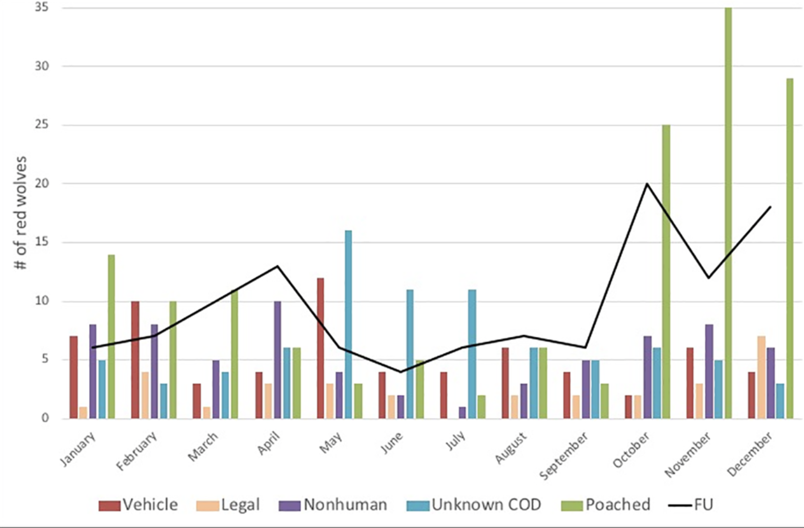

```{r}
library(tidyverse)
library(dplyr)
library(ggthemes)
library(ggplot2)
library(patchwork)

wolfData <- read.table(file = "Data/RW_Dataset.csv", header = T, sep = ",")
glimpse(wolfData)

wolfData <- filter(wolfData, fate != "agency_removal")


p <- ggplot(data=wolfData, mapping=aes(x= Month, fill = factor(fate))) + 
  geom_bar(position = "dodge") +
  theme_classic(base_size=12, base_family="serif") + 
  scale_fill_manual(values = c("red", "black", "bisque", "purple", "green", "blue")) +
  xlab("") + 
  ylab("# of red wolves") + 
  scale_y_continuous(breaks = c(0, 5, 10, 15, 20, 25, 30, 35)) + 
  scale_x_discrete("Jan     Feb     Mar     Apr     May     Jun     Jul     Aug     Sept     Oct     Nov     Dec") + 
  theme(panel.background = element_rect(fill = 'white', color = 'black'), legend.position="bottom",  legend.title= element_blank(), axis.title.y = element_text(size=14, face="bold", colour = "black")) + 
  guides(fill=guide_legend(nrow=1,byrow=TRUE))
  

p
```

Reference Image  


