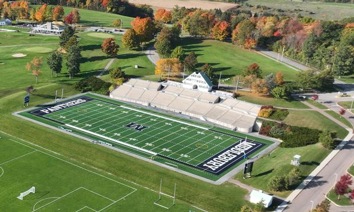

Hello and welcome to my homepage! My name is Josh Mondzelewski and I am a current Sophomore studying Neuroscience at Middlebury College. This is where I will be posting my daily and weekly assignments for the BIOL 1007A course.

# **Daily Assignments**  
  
[Assignment 1](Assignment1.html)

[Assignment 2](Assignment2.html)

[Assignment 3](Assignment3.html)

[Assignment 4](Assignment4.html)

[Assignment 5](Assignment5.html)

[Assignment 6](Assignment6.html)

[Assignment 7](Assignment7.html)

[Assignment 8](Assignment8.html)

[Assignment 9](Assigment9.html)

# **Weekly Assignments**

[Weekly Assignment 1](WeeklyAssignment1.html)

[Weekly Assignment 2](WeeklyAssignment2.html)

[Weekly Assignment 3](WeeklyAssignment3.html)